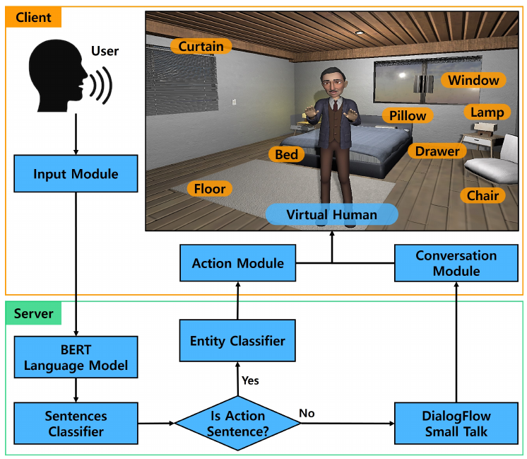

# Auto-generating Virtual Human Behavior by Understanding User Contexts

**Hanseob Kim, Ghazanfar Ali, Seungwon Kim, Gerard J. Kim, Jae-In Hwang**

**IEEE VR Abstracts and Workshops · 2021** · Published

[Paper / publisher](https://doi.org/10.1109/vrw52623.2021.00178) · [Project page](https://ghazanfarali.com/research/context-aware-behavior/) · [BibTeX](CITATION.bib) · [Requirements](REQUIREMENTS.md) · [Code & setup](#implementation-and-usage)

> Natural-language context activates grounded virtual-human actions.



*Original method figure from the paper: Figure 2, PDF page 2. Extracted for this research introduction; the diagram describes the original system, not verification of this reimplementation.*

## Why this research

Fixed trigger phrases make virtual-human actions brittle. Joint language understanding can distinguish conversation from an action request and identify the entities needed to act in a known environment.

A BERT-based model jointly classifies whether a sentence requests conversation or action and extracts action entities. An interaction module turns those predictions into virtual-human behaviors in a controlled room scenario.

## Method at a glance

**Natural-language input** → **Sentence + entity classifier** → **Grounded room behavior**

| | Research system |
|---|---|
| Input | Natural-language conversation and action requests |
| Method | Joint sentence classification and entity classification |
| Output | Action intent, extracted entities, and virtual-human behavior |

## Evidence and scope

Pilot study of perceived naturalness and user experience

**Attribution:** These findings describe the paper or manuscript, not results obtained with this repository's code.

**Study context:** Controlled room scenario with a fixed object and interaction set.

**Limitations:** The controlled object and action inventory limits generalization to arbitrary environments.

## Explore the implementation

A shared BERT backbone with intent/entity heads, labeled-data validation, training/inference and scene-affordance checks before action dispatch.

This repository contains independently written research code. The institute's original source, datasets and trained models are not distributed. Public-data preparation, commands, assumptions and checks are documented below and in [REQUIREMENTS.md](REQUIREMENTS.md).

## Resources and citation

Read the paper through its [publisher record](https://doi.org/10.1109/vrw52623.2021.00178). PDFs are hosted by publishers or preprint archives rather than stored in this repository.

Please cite the research paper when using its ideas; [download the BibTeX citation](CITATION.bib). The implementation has its own documented scope.

## Implementation and usage

<!-- implementation-guide -->

This repository reimplements the core method from **“Auto-generating Virtual Human Behavior by Understanding User Contexts”** by Hanseob Kim, Ghazanfar Ali, Seungwon Kim, Gerard J. Kim, and Jae-In Hwang, IEEE VR Abstracts and Workshops 2021, pp. 591–592. DOI: [10.1109/VRW52623.2021.00178](https://doi.org/10.1109/VRW52623.2021.00178).

The original institute code and 1,200-sentence room dataset are unavailable. This independent implementation provides the paper's essential shared BERT backbone, sentence conversation/action head, three token-level entity heads, joint loss, and grounded action dispatch. It does not include the paper's model weights, participant data, Unity room, animations, speech services, or reported study results.

### Setup

```powershell
py -3.11 -m venv .venv
.venv\Scripts\Activate.ps1
python -m pip install --upgrade pip
pip install -e ".[dev]"
pytest -q
```

The first training run downloads the selected Hugging Face backbone. See the official [BERT model documentation](https://huggingface.co/docs/transformers/model_doc/bert) and [token-classification guide](https://huggingface.co/docs/transformers/main/tasks/token_classification).

### Synthetic quickstart

Run `python scripts/smoke.py` after installation. It saves a small local BERT/tokenizer, trains the normal JSONL pipeline for two CPU epochs, reloads the checkpoint through the inference CLI, and validates the prediction/dispatch output schema. Because randomly initialized weights are not expected to be accurate, a separate known-valid parse checks scene grounding deterministically. Inspect the dataset, checkpoint, prediction, and grounded result under `outputs/smoke/`. For real data, keep the same JSONL and scene contracts below and replace the local backbone and training records.

### Prepare domain data

Training input is UTF-8 JSONL. Spans use Python character offsets (`start` inclusive, `end` exclusive), must not overlap, and must exactly match `value`:

```json
{"text":"Please put the pillow on the bed","intent":"action","entities":[{"start":7,"end":10,"type":"action","value":"put"},{"start":15,"end":21,"type":"target","value":"pillow"},{"start":22,"end":24,"type":"position","value":"on"}]}
{"text":"How are you today?","intent":"conversation","entities":[]}
```

Author a balanced inventory around objects and affordances that actually exist in your scene, then add human-reviewed paraphrases. Keep train/validation/test speakers or templates separate to avoid paraphrase leakage. Validate before training:

```powershell
context-behavior-data validate .\data\train.jsonl
```

For public starting material, the [SNIPS NLU benchmark](https://github.com/snipsco/nlu-benchmark) supplies intent/slot utterances under Apache-2.0. Its domains are not room actions: review its license, map only compatible utterances into this contract, and author the action/position/target labels for your scene. Synthetic utterances must be reviewed because a generator can create impossible or mislabeled actions. No dataset is bundled.

### Train and infer

The default freezes the shared backbone as described in the paper and learns all four heads jointly:

```powershell
context-behavior-train --train .\data\train.jsonl --output .\artifacts\room-model --epochs 5
```

Add `--fine-tune-backbone` to update the backbone. That is an extension, so report it when comparing experiments.

Create `scene.json` to bind language labels to real application capabilities:

```json
{
  "objects": [
    {"id": "lamp", "affordances": ["turn_on", "turn_off"]},
    {"id": "drawer", "affordances": ["open", "close"]}
  ]
}
```

Then run:

```powershell
context-behavior-infer --model .\artifacts\room-model --scene .\scene.json "Please turn on the lamp"
```

Inference reports the predicted intent/entities and a dispatch decision. The dispatcher refuses missing entities, unknown targets, and unsupported affordances. A host application should route accepted commands to its animation controller and conversation intents to its chosen dialogue system.
