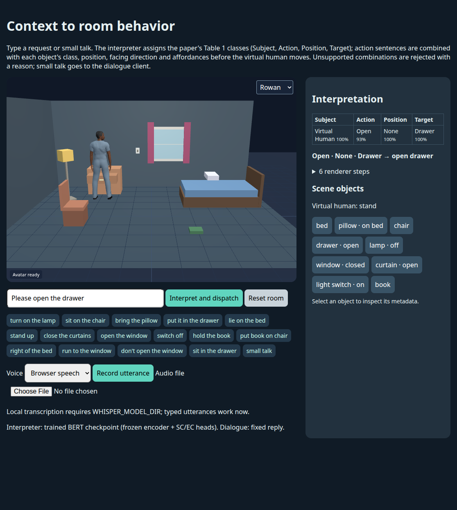

# Auto-generating Virtual Human Behavior by Understanding User Contexts

**Hanseob Kim, Ghazanfar Ali, Seungwon Kim, Gerard J. Kim, Jae-In Hwang**

**IEEE VR Abstracts and Workshops · 2021** · Published

[Paper / publisher](https://doi.org/10.1109/vrw52623.2021.00178) · [Project page](https://ghazanfarali.com/research/context-aware-behavior/) · [BibTeX](CITATION.bib) · [Requirements](REQUIREMENTS.md) · [Code & setup](#implementation-and-usage)

> Natural-language context activates grounded virtual-human actions.


*Original method figure from the paper: Figure 2, PDF page 2. Extracted for this research introduction; the diagram describes the original system, not verification of this reimplementation.*

## Why this research

Fixed trigger phrases make virtual-human actions brittle. Joint language understanding can distinguish conversation from an action request and identify the entities needed to act in a known environment.

A BERT-based model jointly classifies whether a sentence requests conversation or action and extracts action entities. An interaction module turns those predictions into virtual-human behaviors in a controlled room scenario.

## Method at a glance

**Natural-language input** → **Sentence + entity classifier** → **Grounded room behavior**

| | Research system |
|---|---|
| Input | Natural-language conversation and action requests |
| Method | Joint sentence classification and entity classification |
| Output | Action intent, extracted entities, and virtual-human behavior |

## Evidence and scope

Pilot study of perceived naturalness and user experience

**Attribution:** These findings describe the paper or manuscript, not results obtained with this repository's code.

**Study context:** Controlled room scenario with a fixed object and interaction set.

**Limitations:** The controlled object and action inventory limits generalization to arbitrary environments.

## Explore the implementation

A frozen BERT backbone with a sentence head and three Table 1 class heads, an authored starter dataset, and scene-metadata behaviour planning (sit, lie, open/close, switch, bring/hold/put, walk) with rejection of unsupported combinations.

This repository contains independently written research code. The institute's original source, datasets and trained models are not distributed. Public-data preparation, commands, assumptions and checks are documented below and in [REQUIREMENTS.md](REQUIREMENTS.md).

## Resources and citation

Read the paper through its [publisher record](https://doi.org/10.1109/vrw52623.2021.00178). PDFs are hosted by publishers or preprint archives rather than stored in this repository.

Please cite the research paper when using its ideas; [download the BibTeX citation](CITATION.bib). The implementation has its own documented scope.

<!-- demo-preview:start -->
## Demo preview



*Local demo with small starter examples; the capture illustrates the interface, not a reproduced paper benchmark.*

From the repository root, using the Python environment described below:

```sh
python -m pip install -e .
python -m pip install -r scripts/requirements-demo.txt
python scripts/start_demo.py
```

Open **http://127.0.0.1:8080/**. Click **Interpret and dispatch** to act on the prefilled drawer request in the bundled room, or try an example request or small talk. The interpreter uses the trained starter checkpoint in ignored `outputs/starter-model/` when it exists; `python scripts/start_demo.py --train-starter` trains it on the bundled authored starter dataset with a frozen BERT backbone (the first run downloads `bert-base-uncased`). Without a checkpoint the launcher uses the labelled rule fallback and says so. The launcher prepares pinned Three.js modules and downloads one small official BEAT BVH/TextGrid sample on first run. It builds a nine-clip local bank and fits the Automatic Text-to-Gesture rule-map adapter for conversation responses only under ignored `outputs/beat-library/`; later runs reuse the cache. The first run needs internet access. Original recordings, large datasets, institute assets, and pretrained gesture weights are not distributed.

The 3D presentation uses shared Three.js avatar components and bundled fictional CC0 characters. The paper-specific algorithms and data adapters live in this repository.

The application uses `automatic` retrieval for recorded co-speech motion: a current public-demo adapter; it is not a method claimed by the intent/action paper. The intent/entity interpretation and affordance-checked action dispatch remain this application's core; action/navigation poses are separate. The BEAT preparation and retrieval dependencies are vendored in this repository, so no sibling repository checkout is needed. See `scripts/prepare_beat_demo.py` to rebuild the ignored local bank.

<!-- demo-preview:end -->

## Implementation and usage

<!-- implementation-guide -->

This repository reimplements the core method from **“Auto-generating Virtual Human Behavior by Understanding User Contexts”** by Hanseob Kim, Ghazanfar Ali, Seungwon Kim, Gerard J. Kim, and Jae-In Hwang, IEEE VR Abstracts and Workshops 2021, pp. 591–592. DOI: [10.1109/VRW52623.2021.00178](https://doi.org/10.1109/VRW52623.2021.00178).

The original institute code and 1,200-sentence room dataset are unavailable. This independent implementation follows the paper's design:

- **Ontology.** [`ontology.json`](src/context_behavior/resources/ontology.json) holds the Table 1 classes exactly: Subject (None/small talk, Virtual Human), 14 Actions (None, Walk, Open, Close, Sit, Stand up, Turn on, Turn off, Lay, Run, Idle, Bring, Hold, Put), 6 Positions (None, Left, Right, In, On, To) and 11 Targets (None, Floor, Chair, Drawer, Bed, Lamp, Window, Curtain, Object, Pillow, Switch). Authored synonym lists map paraphrases such as *switch on*/*turn on* and *light*/*lamp* onto one class.
- **Model.** A frozen BERT encoder feeds a sentence classifier on [CLS] (Subject) and three entity classifiers over the Action, Position and Target classes. The four heads are trained jointly with the sum of their cross-entropy losses. The paper does not state the entity classifiers' input; here they read [CLS] concatenated with the masked mean of the token vectors.
- **Behaviour.** Each scene object carries a name, Target class, position, facing direction and an affordance table. The planner combines Action + Position + Target with that metadata, for example Sit + On + Chair → walk to the chair's front, turn, and sit at seat height. It rejects unsupported combinations with a reason.
- **Dialogue.** Conversation-class input goes to a pluggable dialogue client, where the paper used DialogFlow.

It does not include the paper's model weights, participant data, Unity room or animations, and it reports no study results.

### Immediate browser demo

```powershell
py -3.11 -m venv .venv
.venv\Scripts\Activate.ps1
pip install -e .
python -m pip install -r scripts/requirements-demo.txt
python scripts/start_demo.py --train-starter
```

`--train-starter` trains `outputs/starter-model/` on the bundled starter dataset, then starts the room with that checkpoint. The first run downloads `google-bert/bert-base-uncased` from Hugging Face; pass `--backbone C:\path\to\local-bert` to use a local copy. Because the encoder is frozen, its sentence features are computed once and only the heads train, so this takes about a minute on a 16-thread CPU. Later `python scripts/start_demo.py` runs reuse the checkpoint. Without one, the room uses the **labelled rule fallback**, and the page names whichever interpreter is active.

The rule fallback matches the ontology synonym lists. It treats questions about the room and negated requests ("Don't open the window") as conversation, and it reads split phrasal verbs from their particle ("Turn the lamp off, it is on" → Turn off). It is a transparent fallback, not the paper's learned classifier.

In the room, each reply shows the four predicted classes. For action requests it also shows the combined behaviour (for example `Sit · On · Chair → sit_on chair`) and the renderer steps. The virtual human walks to each object's approach point, which comes from the object's facing direction, then turns to it. It then sits, lies, reaches, opens or closes, switches lamps and the light switch, or carries props in its hand (bring, hold, put). Click an object button to inspect its metadata. **Reset room** restores the initial state. Small talk is answered by the dialogue client with recorded co-speech motion.

### Starter dataset

[`resources/starter/`](src/context_behavior/resources/starter/) contains 425 sentences written and label-checked for this repository: 359 for training and 66 for validation. They cover every Table 1 class, plus small talk, questions about the room and negated requests. Negated requests are labelled as conversation, so no action is taken. [`provenance.json`](src/context_behavior/resources/starter/provenance.json) records origin, licence (CC0 1.0), split rule and class counts. Rebuild the files with `python scripts/build_starter_dataset.py` after editing the sentence lists.

This is not the paper's dataset. Accuracy on its small validation split only shows that the pipeline learns; it is not a benchmark. Extend it with sentences reviewed for your own scene and keep paraphrases of one template within a single split.

### Data format

Training input is UTF-8 JSONL with one Table 1 class per category. An omitted key or `"None"` means the None class:

```json
{"text": "Please put the pillow on the bed", "subject": "Virtual Human", "action": "Put", "position": "On", "target": "Bed"}
{"text": "Walk to the left", "subject": "Virtual Human", "action": "Walk", "position": "Left", "target": "None"}
{"text": "How are you today?", "subject": "None"}
```

Validation rules:

- Conversation rows must have None entities.
- Virtual Human rows need an Action.
- A Target is required except for Walk, Run, Idle, Stand up, Sit, Lay and Put, which the planner resolves from the scene.

Files in the earlier span format (`intent` plus character-offset `entities`) are converted on load. Each span is mapped onto its class through the ontology synonyms. To rewrite such a file:

```powershell
context-behavior-data validate .\data\train.jsonl
context-behavior-data convert .\data\old-spans.jsonl .\data\train.jsonl
```

### Train and infer

```powershell
context-behavior-train --output .\artifacts\room-model --backbone google-bert/bert-base-uncased
context-behavior-train --train .\data\train.jsonl --val .\data\val.jsonl --output .\artifacts\room-model
context-behavior-infer --model .\artifacts\room-model --scene .\demo\scene.json "Could you switch the light on?"
python -m context_behavior.demo --model .\artifacts\room-model
```

Without `--train`, training uses the starter split. The best epoch by validation loss is kept, and the run writes `metrics.json`.

`--fine-tune-backbone` updates BERT instead of freezing it. That is an extension of the paper, so report it when comparing runs.

The checkpoint folder is self-contained:

- `backbone/`: the encoder config and weights;
- `tokenizer/`;
- `ontology.json`;
- `heads.pt`;
- `config.json`.

Inference needs no network access. The demo server loads the checkpoint once and reuses it for every request. Checkpoints from the earlier token-tagging version are reported as legacy and must be retrained.

### Scene metadata

[`demo/scene.json`](demo/scene.json) uses metres, with +x to the screen's right and -z away from the user. Each object has these fields:

- `name`;
- `class` (a Table 1 Target);
- `position`;
- `facing`: the yaw in degrees of the object's front, where 0 faces the user;
- `size`;
- optional `seat_height`, `surface_height`, `head_direction`, `handle` and `carryable`;
- `affordances`, mapping each Action to its allowed Positions.

Walk and Run (None, To, Left, Right) and Stand up are implicit for every object. A virtual Floor target supports sitting, lying and putting. Left and Right are taken from the user's view. With Open, Close, Turn on, Turn off and Hold they select the hand.

Put labels the destination as Target. With nothing in hand, it first picks up a carryable object named in the sentence ("Put the pillow on the bed"); otherwise it is rejected. Put In a closed drawer opens it first.

The earlier `{id, affordances: ["open", "sit_on", ...]}` scene format is still accepted. `ActionDispatcher.dispatch(intent, entities)` remains as a compatibility wrapper around `BehaviorPlanner`.

### Dialogue client

Conversation-class input is answered by one of three clients:

- `--dialogue fixed` (default): a fixed reply.
- `--dialogue openai --dialogue-url http://127.0.0.1:11434/v1 --dialogue-model <name>`: any OpenAI-compatible chat-completions server, local or hosted. An API key is read only from `CONTEXT_DIALOGUE_API_KEY`.
- `--dialogue command --dialogue-command "<program>"`: a local program that reads the utterance on stdin and prints the reply.

`start_demo.py` passes the same options through. Any client error or timeout falls back to the fixed reply, and the response reports `fallback: true`. Negated requests get a short acknowledgement instead of an action. Replies are spoken with the shared co-speech gesture route (`/api/beat-query`).

### Checks

```powershell
pip install -e ".[dev]"
pytest -q
python scripts/verify.py
```

The tests and `scripts/verify.py` build a tiny randomly initialised local BERT, so they need no downloads. They cover:

- Table 1 loading;
- data validation, including target-less actions and legacy conversion;
- joint training and the self-contained checkpoint reload;
- combination planning, including the Sit + On + Chair → `sit_on` regression and rejected combinations;
- dialogue routing and fallback;
- server-side model caching.

The tiny model's predictions are not expected to be accurate; grounding is checked with known-valid class combinations. Inspect the outputs under `outputs/verify/`.

### Renderer requirements

The room uses the shared renderer's `lookAt`, `reachTo`, `sit`, `lie`, `stand` and `setExpression` when they are available. If an older vendored `static/avatar.js` lacks them, the room still walks, turns, points, moves props and changes object states, but it shows no seated or lying pose. The bundled fictional CC0 character is an integration renderer; the paper's Unity character and animations are not distributed.

### Optional local speech

Browser speech is selected by default. To enable **Local Kokoro** and audio transcription, install `python -m pip install -e ".[speech]"`.

- **Kokoro:** set `KOKORO_MODEL_DIR` to a user-prepared folder containing `config.json`, `kokoro-v1_0.pth` and `voices/af_heart.pt` from [Kokoro-82M](https://huggingface.co/hexgrad/Kokoro-82M). Follow the [Kokoro phonemizer setup](https://github.com/hexgrad/kokoro), including espeak-ng where needed.
- **Transcription:** set `WHISPER_MODEL_DIR` to a locally prepared faster-whisper small model directory containing `model.bin`.

In PowerShell, set `$env:KOKORO_MODEL_DIR='C:\path\to\kokoro'` and `$env:WHISPER_MODEL_DIR='C:\path\to\whisper-small'` before starting the room. Record or upload audio to fill the utterance field; action routing still passes through the scene checks. Missing paths produce explicit errors and never trigger model downloads.

<!-- avatar-recorded-motion:start -->
## Bundled characters and recorded public motion

The browser demos include Rowan and Mira, two new fictional GLB characters built with MPFB and MakeHuman community assets under CC0 1.0. See [avatar licensing and provenance](static/avatars/LICENSE.md). Use the character selector in the stage. The shared renderer supports body bones, ARKit facial channels, and approximate speaking motion.

Recorded motion is adapted to the characters' proportions. Palm landmarks set hand orientation; finger curl uses bounded hinge bends and preserves the character's finger spacing. Thumb-base opposition stays in the authored pose, with conservative recorded curl at the remaining joints. Distal bends are estimated from the preceding joint when fingertip landmarks are absent. Use the companion's hand close-up views to inspect the result.

The [avatar motion companion](static/recorded-motion.html) opens at `/static/recorded-motion.html` while the demo server is running. A small authored motion and face sample loads automatically; click **Play** without uploading files. It also plays locally selected BEAT motion, face, and WAV files on the bundled characters. These are presentation and data-inspection tools, separate from the paper implementation. No BEAT recording, dataset archive, or trained model is bundled. For recorded public motion, install the one preparation dependency and fetch a small official sample into ignored `outputs/beat-demo/`:

```sh
python -m pip install numpy
python scripts/beat_demo/fetch_modalities.py --speaker 1 --sequence 1_wayne_0_1_1 --include-bvh --max-bytes 25000000 --output-dir outputs/beat-demo/source
python scripts/beat_demo/prepare_bvh.py --bvh outputs/beat-demo/source/1_wayne_0_1_1.bvh --output outputs/beat-demo/sample/1_wayne_0_1_1-raw-motion.json --frames 120
python scripts/beat_demo/prepare_modalities.py --sequence 1_wayne_0_1_1 --source outputs/beat-demo/source --output outputs/beat-demo/sample --frames 120
```

Open the companion and select `outputs/beat-demo/sample/1_wayne_0_1_1-raw-motion.json`, `1_wayne_0_1_1-face.json`, and `1_wayne_0_1_1.wav`. The downloader caps each original file at 25 MB; the prepared clip contains up to 120 frames. The viewer uses local files and does not upload them. For other BEAT takes, substitute a matching official speaker and sequence ID.

If you already have OmniMo's processed 52-joint Unity humanoid data, use that normalized motion instead:

```sh
python scripts/beat_demo/prepare.py --dataset /path/to/processed/beat --speaker 1 --take 1_wayne_0_1_1 --output outputs/beat-demo/sample/1_wayne_0_1_1-motion.json --max-frames 120
```

Select the resulting `*-motion.json` in the companion. Its metadata carries the humanoid joint mapping and source-to-avatar coordinate conversion. The viewer fits source FK directions from the avatar's bind pose, following the spine explicitly at branching joints. This avoids applying incompatible source bone twist to the MPFB skin; it does not reproduce exact performer twist. The adapter supports Unity proximal/intermediate/distal finger names. Raw BVH remains a public-data alternative; do not mix the two skeleton conventions.
<!-- avatar-recorded-motion:end -->
